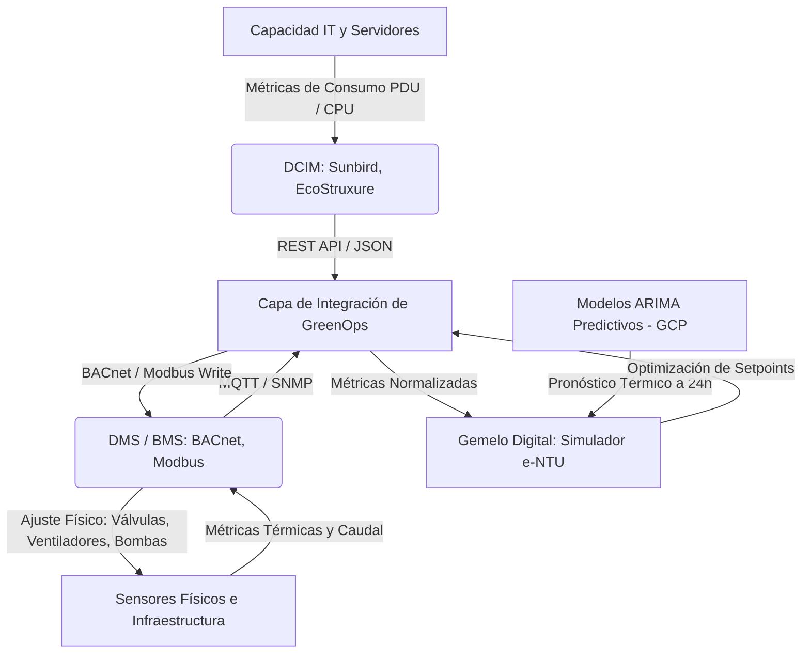
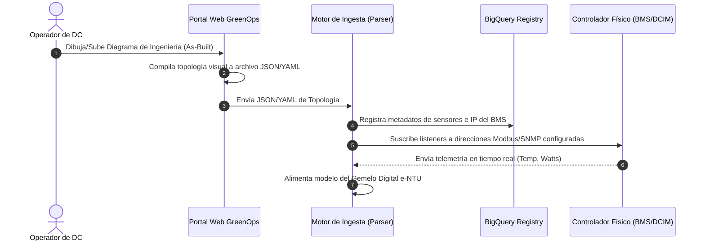
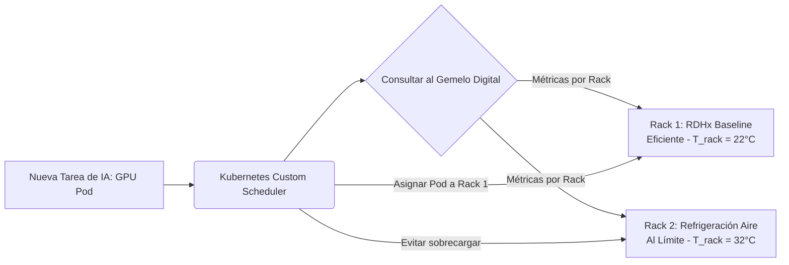

# Arquitectura para Integración, Granularidad e Ingesta a Medida en Data Centers

Esta propuesta técnica detalla la estrategia de diseño de software e ingeniería de sistemas para abordar los tres desafíos planteados por tu profesor guía: **integración DCIM/DMS**, **control granular de cargas intra-data center** y **escalabilidad a medida mediante arquitectura declarativa**.

---

## 1. Integración con Sistemas DCIM y DMS (Desafío 1)

El Gemelo Digital no debe reemplazar las herramientas existentes en el Data Center, sino actuar como un **Cerebro Predictivo de Optimización** que lee datos de telemetría y envía consignas de control (*setpoints*) a los controladores físicos.

### Modelo de Capas de Integración



### Mecanismo de Comunicación:
1. **Capa de Abstracción de Protocolos (Southbound API):**
   * **Modbus/TCP y BACnet/IP:** Para interactuar directamente con el sistema de control del edificio (DMS/BMS). Permite escribir consignas como el ajuste de la velocidad de las bombas de agua helada o la velocidad de ventiladores de la unidad RDHx.
   * **SNMP y Redfish API:** Para comunicarse con el hardware de TI y sistemas DCIM, leyendo el consumo real de las PDUs de los racks y las temperaturas de los procesadores (CPUs/GPUs).

---

### Proceso de Conexión Paso a Paso: Del Diagrama Físico al Gemelo Digital
La empresa del data center no necesita escribir código. El proceso se realiza mediante una interfaz gráfica y un pipeline automatizado:



#### Formato de Entrega del Archivo de Conexión
La configuración se entrega en un formato estructurado **JSON/YAML** generado por el portal de diseño de GreenOps:

```json
{
  "datacenter_id": "santiago-centro-01",
  "gateway_ip": "10.100.1.10",
  "telemetry_sources": [
    {
      "sensor_id": "sens_temp_rack_A1",
      "protocol": "modbus_tcp",
      "register": 30002,
      "scale_factor": 0.1,
      "unit": "celsius"
    },
    {
      "sensor_id": "sens_pdu_rack_A1",
      "protocol": "snmp",
      "oid": "1.3.6.1.4.1.318.1.1.12.2.3.1.1.2.1",
      "unit": "watts"
    }
  ]
}
```

---

## 2. Control de Cargas Granular: Intra-Data Center (Desafío 2)

Controlar las cargas entre diferentes data centers (*inter-DC*) es útil para optimización geográfica, pero la mayor ineficiencia térmica ocurre a nivel micro dentro de una misma sala de servidores debido a los **puntos calientes (hotspots)**.

### Estrategia: Orquestación Sensible a la Temperatura (Thermal-Aware Scheduling)

En lugar de distribuir la carga de IA de manera uniforme (lo que puede sobrecalentar racks que tienen peor flujo de aire), el Gemelo Digital interactúa con el orquestador de contenedores (ej. **Kubernetes**) mediante un plugin de planificación personalizado (*custom scheduler*).



### Implementación Técnica:
* **Mapeo de Sensores Térmicos:** Cada rack reporta su temperatura de entrada y salida de aire al DCIM.
* **Algoritmo de Colocación (Scheduler):** 
  $$\text{Score}_{\text{Rack}} = f(T_{\text{entrada}}, \text{Capacidad Cooling Disponible}, \text{PUE}_{\text{Local}})$$
  Las tareas pesadas (entrenamiento de raíces neuronales) se agrupan en servidores ubicados en racks con tecnologías de enfriamiento líquido directo (D2C) o inmersión, mientras que los racks tradicionales refrigerados por aire se reservan para tareas transitorias o de baja potencia, minimizando la activación de chillers mecánicos.

---

## 3. Escalabilidad mediante Diseño Modular Declarativo (Desafío 3)

Para evitar reescribir el software para cada data center nuevo, el sistema se diseña bajo el principio de **"Configuración sobre Código"**.

### Modelo de Datos Declarativo (YAML/JSON Schema)
La arquitectura y los flujos del data center son entregados por la empresa operadora mediante un archivo de configuración que refleja el diagrama de ingeniería (*as-built*). 

#### Cómo el Grafo reconoce Ciclos Adicionales y Configuraciones Únicas
El motor de simulación no tiene una topología "dura" o precargada en su código. En su lugar, el software representa el data center como un **Grafo Dirigido (Directed Graph)** de calor y fluidos. El resolvedor matemático recorre el grafo utilizando **Ordenamiento Topológico (Topological Sort)** y resuelve los balances de energía elemento a elemento:

1. **Reconocimiento de Bucles Adicionales (Cambiadores de Placas como Puentes):**
   * Un intercambiador de calor (Plate Heat Exchanger - HX) se declara con dos lados: lado caliente (inlet/outlet del bucle A) y lado frío (inlet/outlet del bucle B).
   * Cuando el algoritmo del grafo llega al HX, aplica la ecuación de transferencia $\dot{Q} = \epsilon \dot{C}_{min} (T_{in,hot} - T_{in,cold})$.
   * Esto calcula cuánta energía térmica pasa del Bucle Secundario al Bucle Terciario, recalculando la temperatura de salida de ambos bucles automáticamente.
2. **Reconocimiento de Válvulas Mezcladoras y de Derivación (Bypass):**
   * Un nodo de tipo `three_way_valve` actúa como un **divisor (splitter)** que divide el flujo másico ($\dot{m}_{total} \to \dot{m}_{bypass} + \dot{m}_{chiller}$).
   * Un nodo de tipo `mixing_junction` actúa como un **mezclador**, aplicando la conservación de masa y energía para determinar la temperatura resultante:
     $$T_{mezclado} = \frac{\dot{m}_1 T_1 + \dot{m}_2 T_2}{\dot{m}_1 + \dot{m}_2}$$
   * Con esta matemática de grafos, el resolvedor puede calcular infinitas variaciones de tuberías, sin importar el orden o número de válvulas y ciclos de cada data center.

```yaml
# Ejemplo de Grafo con 3 bucles (D2C Dieléctrico -> Agua Helada -> Condensadora)
cooling_network:
  nodes:
    - id: "bucle_dielectrico"
      type: "loop"
      fluid: "Novec 7100"
    - id: "intercambiador_placas_01"
      type: "heat_exchanger"
      hot_side_in: "bucle_dielectrico"
      cold_side_in: "bucle_agua_helada"
    - id: "bucle_agua_helada"
      type: "loop"
      fluid: "agua"
    - id: "chiller_central"
      type: "chiller"
      inlet: "bucle_agua_helada"
      outlet: "bucle_condensadora"
```

---

### Instanciación de Clases y Extensibilidad (Soporte de Nuevas Tecnologías)
Si un data center incorpora un tipo de enfriamiento no contemplado originalmente, el sistema no se rompe debido al uso del **Patrón de Diseño Fábrica (Factory Pattern)** y el **Polimorfismo**:

1. **Interfaz Común:** Todas las tecnologías de enfriamiento deben heredar de una clase base común y cumplir con su interfaz:
   ```python
   class BaseCoolingModel(ABC):
       @abstractmethod
       def calculate_heat_transfer(self, inlet_temp: float, flow_rate: float, heat_load: float) -> dict:
           """Calcula temperaturas de salida y calor transferido."""
           pass

       @abstractmethod
       def calculate_parasitic_power(self, heat_load: float) -> float:
           """Calcula la energía parásita (ventiladores, bombas)."""
           pass
   ```
2. **Creación del Nuevo Módulo:**
   Cuando hablamos de un **"desarrollador"**, en la ingeniería moderna no nos limitamos exclusivamente a una **persona física (humana)**.
   * **Agente Programador de IA:** Gracias al diseño modular y estricto cumplimiento de la interfaz `BaseCoolingModel`, un **Agente de IA de Código** (como el LLM que diseña este sistema) puede leer la descripción matemática de una patente o tecnología nueva de enfriamiento (ej. enfriamiento por adsorción) y escribir de manera autónoma la clase en Python correspondiente, inyectándola al repositorio sin intervención humana directa.
   * **Desarrollador Humano:** O bien un ingeniero de la empresa del data center puede extender la clase de forma aislada sin tener que entender el resto de la base de código.

---

## 4. Estrategia para el Documento de la Tesis

Para incorporar estas ideas de forma académica en tu tesis, te sugiero agregarlas en los siguientes apartados:

### En el Capítulo 3 (Metodología):
* **Sección 3.3 (Arquitectura del simulador):** Describe cómo se pasa de un modelo fijo a un motor basado en grafos dinámicos utilizando la topología declarativa en YAML. Explica que esto asegura la replicabilidad del software en centros de datos con configuraciones híbridas (por ejemplo, salas que combinan racks convencionales y racks de alta densidad con cambio de fase).
* **Sección 3.4 (Esquema de integración):** Añade un subapartado titulado *"Integración y Adquisición de Datos a nivel de DCIM y DMS"*, describiendo el uso de Modbus/BACnet para telemetría y control de actuadores en lazo cerrado.

### En el Capítulo 5 (Conclusiones y Trabajo Futuro):
* **Sección 5.2 (Líneas de investigación futura):**
  1. *Orquestación térmica inteligente a nivel de hipervisor/Kubernetes:* Discutir la transición de migrar cargas geográficamente a migrar cargas entre servidores del mismo rack para evitar puntos calientes locales.
  2. *Sistemas de control adaptativo multivariable:* Integrar las señales de consigna de GreenOps directamente en los PLCs de las unidades enfriadoras (chillers) del data center real.
