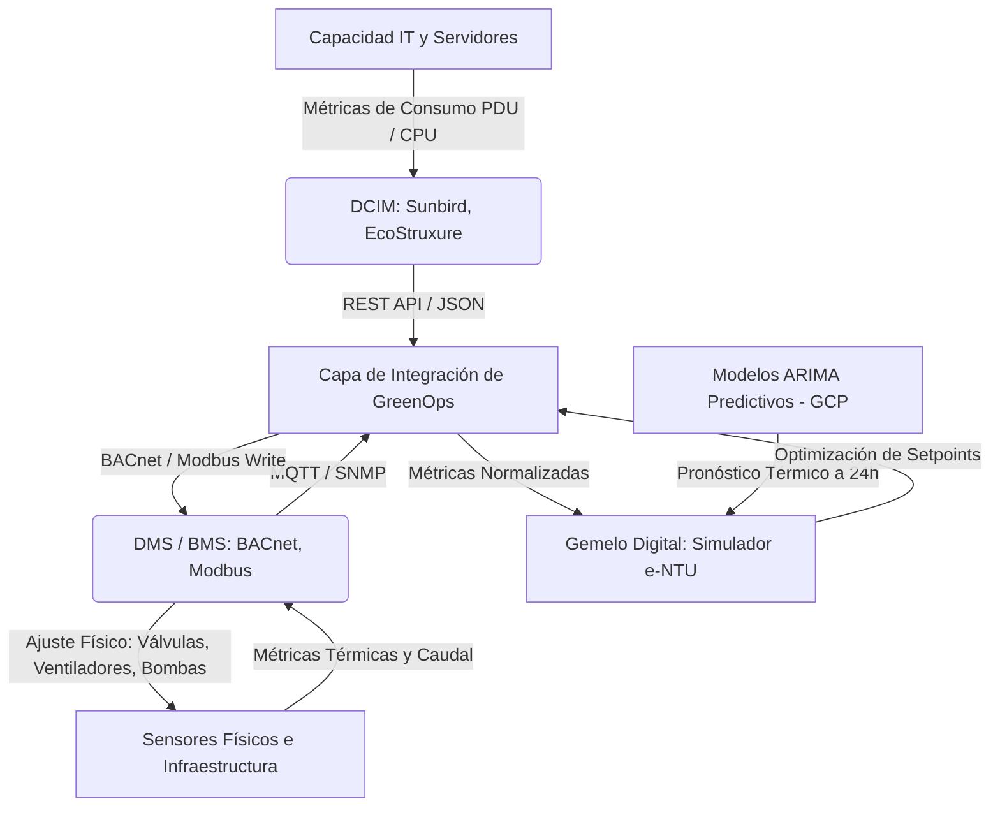
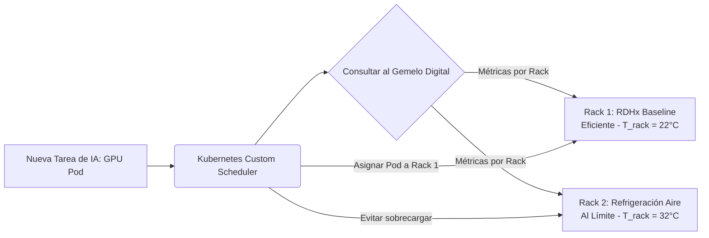

# Arquitectura para Integración, Granularidad e Ingesta a Medida en Data Centers

Esta propuesta técnica detalla la estrategia de diseño de software e ingeniería de sistemas para abordar los tres desafíos planteados por tu profesor guía: **integración DCIM/DMS**, **control granular de cargas intra-data center** y **escalabilidad a medida mediante arquitectura declarativa**.

---

## 1. Integración con Sistemas DCIM y DMS (Desafío 1)

El Gemelo Digital no debe reemplazar las herramientas existentes en el Data Center, sino actuar como un **Cerebro Predictivo de Optimización** que lee datos de telemetría y envía consignas de control (*setpoints*) a los controladores físicos.

### Modelo de Capas de Integración



### Mecanismo de Comunicación:
1. **Capa de Abstracción de Protocolos (Southbound API):**
   * **Modbus/TCP y BACnet/IP:** Para interactuar directamente con el sistema de control del edificio (DMS/BMS). Permite escribir consignas como el ajuste de la velocidad de las bombas de agua helada o la velocidad de ventiladores de la unidad RDHx.
   * **SNMP y Redfish API:** Para comunicarse con el hardware de TI y sistemas DCIM, leyendo el consumo real de las PDUs de los racks y las temperaturas de los procesadores (CPUs/GPUs).

### Conexión con la Configuración Específica (Mapeo de Telemetría)
Para conectar los protocolos genéricos con el plano del data center, el archivo de topología de configuración incluye un bloque de **mapeo de direcciones y registros** en cada elemento. Esto asocia las variables físicas con sus fuentes de telemetría reales:

```yaml
# Fragmento del archivo de configuración del Data Center
racks:
  - id: "rack_ia_01"
    row: "A"
    max_power_kw: 100.0
    telemetry_mapping:
      power_draw:
        protocol: "snmp"
        host: "10.100.2.11"
        community: "public"
        oid: "1.3.6.1.4.1.318.1.1.12.2.3.1.1.2.1" # OID del sensor de PDU APC
        update_interval_sec: 10
      temp_inlet:
        protocol: "modbus_tcp"
        host: "10.100.5.50"
        port: 502
        register_address: 30002 # Registro del sensor Modbus de entrada del rack
        data_type: "float32"
```
El motor de ingesta lee estas definiciones al inicializar el sistema y suscribe hilos de escucha específicos que actualizan las variables del Gemelo Digital automáticamente, manteniendo la lógica matemática aislada de los detalles de red física.

---

## 2. Control de Cargas Granular: Intra-Data Center (Desafío 2)

Controlar las cargas entre diferentes data centers (*inter-DC*) es útil para optimización geográfica, pero la mayor ineficiencia térmica ocurre a nivel micro dentro de una misma sala de servidores debido a los **puntos calientes (hotspots)**.

### Estrategia: Orquestación Sensible a la Temperatura (Thermal-Aware Scheduling)

En lugar de distribuir la carga de IA de manera uniforme (lo que puede sobrecalentar racks que tienen peor flujo de aire), el Gemelo Digital interactúa con el orquestador de contenedores (ej. **Kubernetes**) mediante un plugin de planificación personalizado (*custom scheduler*).



### Implementación Técnica:
* **Mapeo de Sensores Térmicos:** Cada rack reporta su temperatura de entrada y salida de aire al DCIM.
* **Algoritmo de Colocación (Scheduler):** 
  $$\text{Score}_{\text{Rack}} = f(T_{\text{entrada}}, \text{Capacidad Cooling Disponible}, \text{PUE}_{\text{Local}})$$
  Las tareas pesadas (entrenamiento de redes neuronales) se agrupan en servidores ubicados en racks con tecnologías de enfriamiento líquido directo (D2C) o inmersión, mientras que los racks tradicionales refrigerados por aire se reservan para tareas transitorias o de baja potencia, minimizando la activación de chillers mecánicos.

---

## 3. Escalabilidad mediante Diseño Modular Declarativo (Desafío 3)

Para evitar reescribir el software para cada data center nuevo, el sistema debe diseñarse bajo el principio de **"Configuración sobre Código"**.

### Modelo de Datos Declarativo (YAML/JSON Schema)
La arquitectura y los flujos del data center son entregados por la empresa operadora mediante un archivo de configuración que refleja el diagrama de ingeniería (*as-built*). 

#### Manejo de Topologías Complejas (Grafos de Enfriamiento)
Muchos centros de datos no tienen un balance térmico simple, sino que integran **ciclos adicionales (bucles secundarios/terciarios), válvulas de derivación (bypass), y múltiples intercambiadores en serie o paralelo**. Para modelar esto sin reescribir el código, la configuración del data center se representa como un **Grafo Acíclico de Redes de Enfriamiento (Cooling Directed Graph)**:

```yaml
datacenter:
  name: "Santiago-Centro-01"
  region: "Sudamérica"
  tarifa_electricidad: 0.176
  
  # Declaración de componentes como nodos del grafo
  cooling_network:
    nodes:
      - id: "chiller_01"
        type: "chiller_water_cooled"
        capacity_kw: 500
        cop: 4.5
        
      - id: "valve_bypass_01"
        type: "three_way_valve"
        parameters:
          default_bypass_ratio: 0.2 # 20% de bypass en condiciones estándar
          
      - id: "rack_loop_hx"
        type: "plate_heat_exchanger"
        parameters:
          UA: 8500 # W/K (Coeficiente global de transferencia)
          
    # Definición de conexiones (tuberías y flujo del refrigerante)
    edges:
      - from: "chiller_01"
        to: "valve_bypass_01"
        loop: "primary_loop"
      - from: "valve_bypass_01"
        to: "rack_loop_hx"
        loop: "primary_loop_regulated"
      - from: "rack_loop_hx"
        to: "chiller_01"
        loop: "primary_return"
```

El motor del software resuelve este grafo utilizando un resolvedor de balance de masa y energía (similar a las leyes de Kirchhoff para circuitos hidráulicos) calculando las caídas de presión y de temperatura a través de cada nodo de forma secuencial.

---

### Instanciación de Clases y Extensibilidad (Soporte de Nuevas Tecnologías)
Si un data center incorpora un tipo de enfriamiento no contemplado originalmente (por ejemplo, enfriamiento evaporativo directo o disipación geotérmica), el sistema no se rompe debido al uso del **Patrón de Diseño Fábrica (Factory Pattern)** y el **Polimorfismo**:

1. **Interfaz Común:** Todas las tecnologías de enfriamiento deben heredar de una clase base común y cumplir con su interfaz:
   ```python
   class BaseCoolingModel(ABC):
       @abstractmethod
       def calculate_heat_transfer(self, inlet_temp: float, flow_rate: float, heat_load: float) -> dict:
           """Calcula temperaturas de salida y calor transferido."""
           pass

       @abstractmethod
       def calculate_parasitic_power(self, heat_load: float) -> float:
           """Calcula la energía parásita (ventiladores, bombas)."""
           pass
   ```
2. **Creación del Nuevo Módulo:** Si la empresa tiene una tecnología patentada nueva, un desarrollador solo debe crear la subclase correspondiente:
   ```python
   class EvaporativeCoolingModel(BaseCoolingModel):
       # Implementación matemática propia del enfriamiento evaporativo
       ...
   ```
3. **Inyección en el Motor:** Al registrar la nueva clase en la fábrica de modelos, el motor del software leerá el parámetro `type: "Evaporative"` en el archivo YAML de la empresa e instanciará la clase correcta en tiempo de ejecución de manera transparente.

---

## 4. Estrategia para el Documento de la Tesis

Para incorporar estas ideas de forma académica en tu tesis, te sugiero agregarlas en los siguientes apartados:

### En el Capítulo 3 (Metodología):
* **Sección 3.3 (Arquitectura del simulador):** Describe cómo se pasa de un modelo fijo a un motor basado en grafos dinámicos utilizando la topología declarativa en YAML. Explica que esto asegura la replicabilidad del software en centros de datos con configuraciones híbridas (por ejemplo, salas que combinan racks convencionales y racks de alta densidad con cambio de fase).
* **Sección 3.4 (Esquema de integración):** Añade un subapartado titulado *"Integración y Adquisición de Datos a nivel de DCIM y DMS"*, describiendo el uso de Modbus/BACnet para telemetría y control de actuadores en lazo cerrado.

### En el Capítulo 5 (Conclusiones y Trabajo Futuro):
* **Sección 5.2 (Líneas de investigación futura):**
  1. *Orquestación térmica inteligente a nivel de hipervisor/Kubernetes:* Discutir la transición de migrar cargas geográficamente a migrar cargas entre servidores del mismo rack para evitar puntos calientes locales.
  2. *Sistemas de control adaptativo multivariable:* Integrar las señales de consigna de GreenOps directamente en los PLCs de las unidades enfriadoras (chillers) del data center real.
