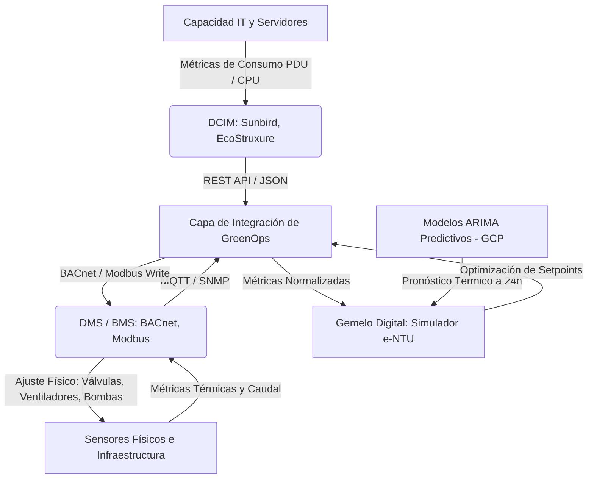
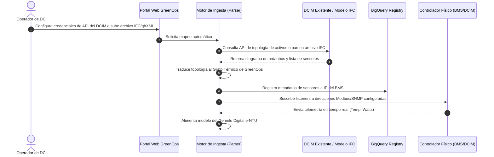
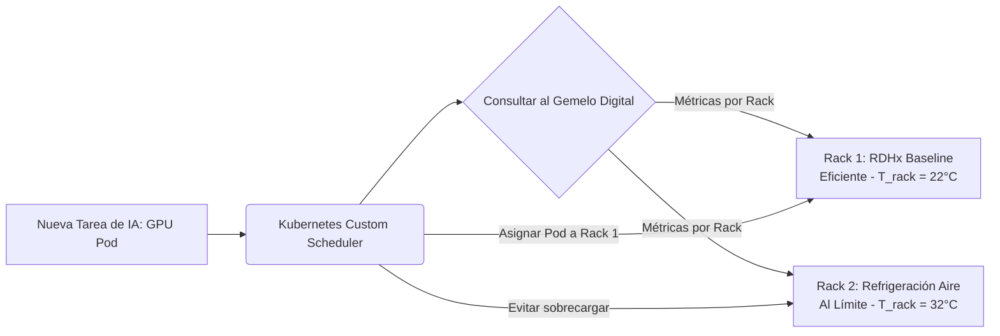
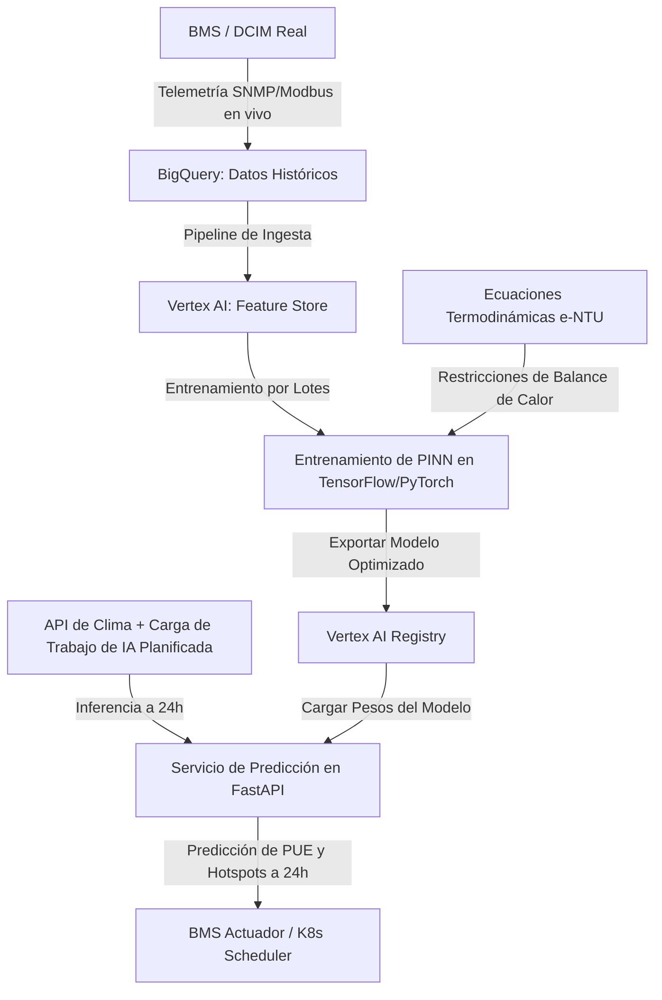

# Arquitectura para Integración, Granularidad e Ingesta a Medida en Data Centers

Esta propuesta técnica detalla la estrategia de diseño de software e ingeniería de sistemas para abordar los tres desafíos planteados por tu profesor guía: **integración DCIM/DMS**, **control granular de cargas intra-data center** y **escalabilidad a medida mediante arquitectura declarativa**.

---

## 1. Integración con Sistemas DCIM y DMS (Desafío 1)

El Gemelo Digital no debe reemplazar las herramientas existentes en el Data Center, sino actuar como un **Cerebro Predictivo de Optimización** que lee datos de telemetría y envía consignas de control (*setpoints*) a los controladores físicos.

### Modelo de Capas de Integración



### Mecanismo de Comunicación:
1. **Capa de Abstracción de Protocolos (Southbound API):**
   * **Modbus/TCP y BACnet/IP:** Para interactuar directamente con el sistema de control del edificio (DMS/BMS). Permite escribir consignas como el ajuste de la velocidad de las bombas de agua helada o la velocidad de ventiladores de la unidad RDHx.
   * **SNMP y Redfish API:** Para comunicarse con el hardware de TI y sistemas DCIM, leyendo el consumo real de las PDUs de los racks y las temperaturas de los procesadores (CPUs/GPUs).

---

### Integración Inteligente: Auto-Descubrimiento y Lectura Directa (Evitar la Replicación)
Para evitar la carga manual de datos, GreenOps DC implementa tres métodos de **auto-descubrimiento** para conectarse directamente a las bases de datos de diseño y diagramas existentes del data center:

1. **Conexión Directa a APIs de DCIM/BMS (Schneider, Sunbird, Nlyte):**
   * Las plataformas DCIM modernas exponen APIs REST que contienen el árbol completo de relaciones espaciales y conexiones eléctricas. 
   * GreenOps DC consulta endpoints como `/api/v2/topology/assets` para extraer la jerarquía (Sala $\to$ Pasillo $\to$ Rack $\to$ Servidor) y mapear qué sensores de temperatura y PDUs están físicamente asociados a cada elemento del grafo térmico de forma automática.
2. **Ingesta de Modelos de Diseño BIM / CAD (Estándares IFC y gbXML):**
   * El data center ya cuenta con su diseño de ingeniería en herramientas de modelado 3D (Autodesk Revit, Bentley, OpenBIM). Estos planos se exportan en formato abierto **IFC (Industry Foundation Classes)** o **gbXML (Green Building XML)**.
   * El parser de GreenOps lee estos archivos e interpreta las clases de flujo (por ejemplo, `IfcFlowSegment` como tuberías, `IfcEnergyConversionDevice` como chillers/intercambiadores y `IfcFlowMovingDevice` como bombas), construyendo el grafo térmico del bucle de enfriamiento automáticamente y sin intervención manual.
3. **Escaneo de Red Activo (SNMP & SSDP Discovery):**
   * GreenOps DC realiza un barrido de red local buscando dispositivos que expongan puertos SNMP y Redfish. Identifica las PDUs inteligentes y los controladores de chillers de forma autónoma, autogenerando el mapa de telemetría física.

### Proceso de Conexión Paso a Paso: Del Sistema Existente al Gemelo Digital



#### Formato de Entrega del Archivo de Conexión
La configuración se entrega en un formato estructurado **JSON/YAML** generado por el portal de diseño de GreenOps:

```json
{
  "datacenter_id": "santiago-centro-01",
  "gateway_ip": "10.100.1.10",
  "telemetry_sources": [
    {
      "sensor_id": "sens_temp_rack_A1",
      "protocol": "modbus_tcp",
      "register": 30002,
      "scale_factor": 0.1,
      "unit": "celsius"
    },
    {
      "sensor_id": "sens_pdu_rack_A1",
      "protocol": "snmp",
      "oid": "1.3.6.1.4.1.318.1.1.12.2.3.1.1.2.1",
      "unit": "watts"
    }
  ]
}
```

---

## 2. Control de Cargas Granular: Intra-Data Center (Desafío 2)

Controlar las cargas entre diferentes data centers (*inter-DC*) es útil para optimización geográfica, pero la mayor ineficiencia térmica ocurre a nivel micro dentro de una misma sala de servidores debido a los **puntos calientes (hotspots)**.

### Estrategia: Orquestación Sensible a la Temperatura (Thermal-Aware Scheduling)

En lugar de distribuir la carga de IA de manera uniforme (lo que puede sobrecalentar racks que tienen peor flujo de aire), el Gemelo Digital interactúa con el orquestador de contenedores (ej. **Kubernetes**) mediante un plugin de planificación personalizado (*custom scheduler*).



### Implementación Técnica:
* **Mapeo de Sensores Térmicos:** Cada rack reporta su temperatura de entrada y salida de aire al DCIM.
* **Algoritmo de Colocación (Scheduler):** 
  $$\text{Score}_{\text{Rack}} = f(T_{\text{entrada}}, \text{Capacidad Cooling Disponible}, \text{PUE}_{\text{Local}})$$
  Las tareas pesadas (entrenamiento de raíces neuronales) se agrupan en servidores ubicados en racks con tecnologías de enfriamiento líquido directo (D2C) o inmersión, mientras que los racks tradicionales refrigerados por aire se reservan para tareas transitorias o de baja potencia, minimizando la activación de chillers mecánicos.

---

## 3. Escalabilidad mediante Diseño Modular Declarativo (Desafío 3)

Para evitar reescribir el software para cada data center nuevo, el sistema se diseña bajo el principio de **"Configuración sobre Código"**.

### Modelo de Datos Declarativo (YAML/JSON Schema)
La arquitectura y los flujos del data center son entregados por la empresa operadora mediante un archivo de configuración que refleja el diagrama de ingeniería (*as-built*). 

#### Cómo el Grafo reconoce Ciclos Adicionales y Configuraciones Únicas
El motor de simulación no tiene una topología "dura" o precargada en su código. En su lugar, el software representa el data center como un **Grafo Dirigido (Directed Graph)** de calor y fluidos. El resolvedor matemático recorre el grafo utilizando **Ordenamiento Topológico (Topological Sort)** y resuelve los balances de energía elemento a elemento:

1. **Reconocimiento de Bucles Adicionales (Cambiadores de Placas como Puentes):**
   * Un intercambiador de calor (Plate Heat Exchanger - HX) se declara con dos lados: lado caliente (inlet/outlet del bucle A) y lado frío (inlet/outlet del bucle B).
   * Cuando el algoritmo del grafo llega al HX, aplica la ecuación de transferencia $\dot{Q} = \epsilon \dot{C}_{min} (T_{in,hot} - T_{in,cold})$.
   * Esto calcula cuánta energía térmica pasa del Bucle Secundario al Bucle Terciario, recalculando la temperatura de salida de ambos bucles automáticamente.
2. **Reconocimiento de Válvulas Mezcladoras y de Derivación (Bypass):**
   * Un nodo de tipo `three_way_valve` actúa como un **divisor (splitter)** que divide el flujo másico ($\dot{m}_{total} \to \dot{m}_{bypass} + \dot{m}_{chiller}$).
   * Un nodo de tipo `mixing_junction` actúa como un **mezclador**, aplicando la conservación de masa y energía para determinar la temperatura resultante:
     $$T_{mezclado} = \frac{\dot{m}_1 T_1 + \dot{m}_2 T_2}{\dot{m}_1 + \dot{m}_2}$$
   * Con esta matemática de grafos, el resolvedor puede calcular infinitas variaciones de tuberías, sin importar el orden o número de válvulas y ciclos de cada data center.

```yaml
# Ejemplo de Grafo con 3 bucles (D2C Dieléctrico -> Agua Helada -> Condensadora)
cooling_network:
  nodes:
    - id: "bucle_dielectrico"
      type: "loop"
      fluid: "Novec 7100"
    - id: "intercambiador_placas_01"
      type: "heat_exchanger"
      hot_side_in: "bucle_dielectrico"
      cold_side_in: "bucle_agua_helada"
    - id: "bucle_agua_helada"
      type: "loop"
      fluid: "agua"
    - id: "chiller_central"
      type: "chiller"
      inlet: "bucle_agua_helada"
      outlet: "bucle_condensadora"
```

---

### Instanciación de Clases y Extensibilidad (Soporte de Nuevas Tecnologías)
Si un data center incorpora un tipo de enfriamiento no contemplado originalmente, el sistema no se rompe debido al uso del **Patrón de Diseño Fábrica (Factory Pattern)** y el **Polimorfismo**:

1. **Interfaz Común:** Todas las tecnologías de enfriamiento deben heredar de una clase base común y cumplir con su interfaz:
   ```python
   class BaseCoolingModel(ABC):
       @abstractmethod
       def calculate_heat_transfer(self, inlet_temp: float, flow_rate: float, heat_load: float) -> dict:
           """Calcula temperaturas de salida y calor transferido."""
           pass

       @abstractmethod
       def calculate_parasitic_power(self, heat_load: float) -> float:
           """Calcula la energía parásita (ventiladores, bombas)."""
           pass
   ```
2. **Creación del Nuevo Módulo:**
   Cuando hablamos de un **"desarrollador"**, en la ingeniería moderna no nos limitamos exclusivamente a una **persona física (humana)**.
   * **Agente Programador de IA:** Gracias al diseño modular y estricto cumplimiento de la interfaz `BaseCoolingModel`, un **Agente de IA de Código** (como el LLM que diseña este sistema) puede leer la descripción matemática de una patente o tecnología nueva de enfriamiento (ej. enfriamiento por adsorción) y escribir de manera autónoma la clase en Python correspondiente, inyectándola al repositorio sin intervención humana directa.
   * **Desarrollador Humano:** O bien un ingeniero de la empresa del data center puede extender la clase de forma aislada sin tener que entender el resto de la base de código.

---

## 4. Aprendizaje Adaptativo y Modelado Predictivo con Redes Neuronales

Para que el Gemelo Digital no sea solo un modelo matemático estático, sino que **aprenda dinámicamente de la firma térmica específica** del data center al que está conectado, se implementa una arquitectura de **Modelado Híbrido (Grey-Box Modeling)** utilizando **Redes Neuronales Informadas por la Física (Physics-Informed Neural Networks - PINNs)**.

### El Enfoque de Modelado Híbrido (Física + Deep Learning)
* **El Problema de las Redes "Caja Negra" (Black-Box):** Si entrenamos una red neuronal estándar (como una LSTM o un Perceptrón Multicapa) con datos de temperatura del data center, la red puede predecir valores imposibles que violen la física (por ejemplo, predecir que la temperatura del chip es menor que la del agua refrigerante que entra al rack, violando la Segunda Ley de la Termodinámica).
* **La Solución (PINNs):** La red neuronal aprende del data center, pero **su función de pérdida (Loss Function) está penalizada y limitada por las ecuaciones físicas de balance térmico** ($\epsilon$-NTU y calor sensible) que definimos en el Capítulo 2.

La función de pérdida total del entrenamiento ($\mathcal{L}$) se define como:

$$\mathcal{L} = \mathcal{L}_{\text{datos}} + \lambda \cdot \mathcal{L}_{\text{física}}$$

Donde:
1. **$\mathcal{L}_{\text{datos}}$ (Pérdida de datos):** Es el error cuadrático medio (MSE) entre las predicciones del modelo y las lecturas reales de los sensores del data center (temperatura real del silicio, consumo real de PDUs).
2. **$\mathcal{L}_{\text{física}}$ (Pérdida física):** Es el residuo de las ecuaciones diferenciales termodinámicas. Si la predicción viola el balance energético de $\dot{Q} = \dot{m} C_p \Delta T$, se le aplica una penalización matemática masiva al modelo.
3. **$\lambda$:** Es el peso de regularización física.

### Arquitectura del Pipeline de Aprendizaje Continuo (GCP Vertex AI)



### ¿Qué aprende la Red Neuronal específicamente en el Data Center?
La física nos da el comportamiento ideal, pero la red neuronal aprende las **desviaciones de la realidad** de cada edificio:
1. **Incrustación / Suciedad del Intercambiador (Fouling Factor):** Con el tiempo, el coeficiente global de transferencia de calor ($UA$) de los intercambiadores de placas disminuye debido a la suciedad del agua. La red neuronal detecta esta deriva comparando el calor teórico versus el real y ajusta el coeficiente de efectividad predictivo.
2. **Dinámica de Flujos de Aire (Turbulencias Locales):** Aprende cómo influye el flujo de aire de los ventiladores de la sala y los obstáculos físicos (cables, geometría de racks) en la formación de puntos calientes (*hotspots*) locales.
3. **Inercia Térmica del Edificio:** Aprende cuánto tiempo tarda en calentarse o enfriarse la masa de agua del bucle primario cuando la temperatura exterior sube repentinamente, permitiendo un pre-enfriamiento predictivo óptimo.

---

## 5. Requisitos para la Implementación Real en Producción

Para llevar estas tres opciones de auto-descubrimiento desde el prototipo actual de simulación hacia una infraestructura en producción real, se requieren las siguientes tecnologías, librerías y accesos físicos:

### A. Para la Sincronización Real con DCIM (Opción 1)
* **Conectividad de Red:** El servidor de GreenOps DC (ej. corriendo en GCP) necesita un canal de comunicación privado y seguro hacia el servidor DCIM del data center local. Esto se resuelve mediante una **VPN IPsec** o **Google Cloud Interconnect**.
* **Acceso y Autorización:** Se requiere que el administrador del DCIM genere un **API Access Token** (usualmente un Bearer token JWT) con permisos de solo lectura para los endpoints de activos y telemetría.
* **Librería en Python:** En el backend de FastAPI de GreenOps, se utiliza la librería estándar **`requests`** o un cliente HTTP asíncrono como **`httpx`** para realizar peticiones periódicas (polling) o recibir Webhooks del DCIM ante cambios de inventario:
  ```python
  import httpx
  async def fetch_dcim_topology():
      headers = {"Authorization": "Bearer JWT_SECRET_TOKEN"}
      async with httpx.AsyncClient() as client:
          response = await client.get("https://dcim.empresa.com/api/v2/topology", headers=headers)
          return response.json()
  ```

### B. Para el Procesamiento de Modelos BIM / IFC Real (Opción 2)
* **Pipeline de Ingesta:** Un servicio de carga de archivos en el backend que reciba los planos en frío en formato `.ifc` o `.gbxml` y los almacene en un bucket de almacenamiento temporal (como Google Cloud Storage).
* **Librerías de Parser Térmico en Python:**
  * **`IfcOpenShell`:** Es la librería de código abierto estándar de la industria en Python para parsear y manipular archivos IFC (BIM). Permite extraer propiedades estructurales de las tuberías y equipos térmicos.
  * **`lxml` o `xml.etree.ElementTree`:** Si el plano se entrega en el estándar gbXML (un esquema XML especializado en balances energéticos de edificios).
* **Ejemplo de Código de Parseo Real (IFC):**
  ```python
  import ifcopenshell
  def extract_cooling_elements(ifc_file_path):
      model = ifcopenshell.open(ifc_file_path)
      # Filtrar todos los dispositivos de intercambio de energía (chillers, intercambiadores)
      energy_devices = model.by_type("IfcEnergyConversionDevice")
      for device in energy_devices:
          print(f"Dispositivo detectado: {device.Name}, Tipo IFC: {device.is_a()}")
          # Aquí se extraen las conexiones de entrada/salida (puertos) para armar el grafo
  ```

### C. Para el Escaneo de Red Activo Real (Opción 3)
* **Acceso Físico a la LAN de Control:** El Gateway de GreenOps debe estar físicamente conectado o ruteado hacia la **red local de administración de infraestructura (Management LAN)**, que es una red aislada de internet donde residen las direcciones IP fijas de las PDUs, los PLCs Modbus y los chillers.
* **Protocolos e Infraestructura de Red:**
  * **Comunidad SNMP:** Conocer la "community string" (por ejemplo, `public` para SNMPv2c) o contar con credenciales de usuario y llaves de cifrado para SNMPv3 (estándar de alta seguridad).
* **Librerías de Escaneo en Python:**
  * **`scapy` o `nmap` (vía `python-nmap`):** Para realizar el barrido de hosts activos (Ping Sweep) e identificar qué IPs están respondiendo en los puertos estándar de SNMP (161) y Modbus (502).
  * **`pysnmp`:** Librería de Python para interrogar a las PDUs y descubrir sus OIDs específicos para lectura de potencia eléctrica.
  * **`pyModbusTCP` o `pymodbus`:** Librería de Python para abrir sockets Modbus TCP directos con los PLCs de climatización y leer/escribir registros de temperatura y velocidad de bombas.
  * **Ejemplo de Lectura Real Modbus:**
    ```python
    from pyModbusTCP.client import ModbusClient
    def read_plc_temperature(ip_address):
        client = ModbusClient(host=ip_address, port=502, auto_open=True, auto_close=True)
        # Leer el registro analógico 40001 (temperatura del agua de retorno)
        regs = client.read_holding_registers(0, 1)
        if regs:
            return regs[0] / 10.0 # El registro suele almacenar la temp multiplicada por 10 (ej: 225 = 22.5°C)
        return None
    ```

---

## 6. Estrategia para el Documento de la Tesis

Para incorporar estas ideas de forma académica en tu tesis, te sugiero agregarlas en los siguientes apartados:

### En el Capítulo 3 (Metodología):
* **Sección 3.3 (Arquitectura del simulador):** Describe cómo se pasa de un modelo fijo a un motor basado en grafos dinámicos utilizando la topología declarativa en YAML. Explica que esto asegura la replicabilidad del software en centros de datos con configuraciones híbridas (por ejemplo, salas que combinan racks convencionales y racks de alta densidad con cambio de fase).
* **Sección 3.4 (Esquema de integración):** Añade un subapartado titulado *"Integración y Adquisición de Datos a nivel de DCIM y DMS"*, describiendo el uso de Modbus/BACnet para telemetría y control de actuadores en lazo cerrado y los requisitos de auto-descubrimiento (pysnmp, IfcOpenShell, etc.).

### En el Capítulo 5 (Conclusiones y Trabajo Futuro):
* **Sección 5.2 (Líneas de investigación futura):**
  1. *Orquestación térmica inteligente a nivel de hipervisor/Kubernetes:* Discutir la transición de migrar cargas geográficamente a migrar cargas entre servidores del mismo rack para evitar puntos calientes locales.
  2. *Sistemas de control adaptativo multivariable:* Integrar las señales de consigna de GreenOps directamente en los PLCs de las unidades enfriadoras (chillers) del data center real.
