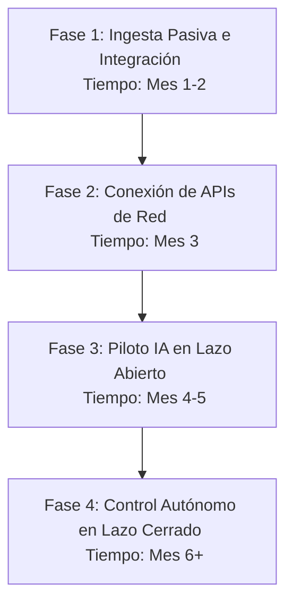

# GreenOps DC: Propuesta de Negocio y Hoja de Ruta para Inversión

Este documento detalla la estrategia comercial, la viabilidad técnica y los pasos concretos para escalar la plataforma de optimización termodinámica y ESG **GreenOps DC** desde el prototipo actual hasta un producto comercializable en el mercado latinoamericano y global.

---

## 1. La Oportunidad de Negocio

El auge de la Inteligencia Artificial y la computación de alta densidad está llevando a los data centers a su límite energético. En mercados como Chile, el costo eléctrico representa hasta el **60% del costo operativo (OPEX)** de un data center. 

**GreenOps DC** resuelve dos dolores críticos de los operadores de infraestructura:
1. **Reducción Directa de OPEX:** Ahorro de hasta un 30% en costos de enfriamiento mediante control autónomo por IA (Free Cooling optimizado).
2. **Cumplimiento ESG Automatizado:** Generación automática de reportes de emisiones de Alcance 2 (Scope 2 GHG Protocol), indispensables para auditorías corporativas y financiamiento verde.

---

## 2. Alternativa a Bloomberg: Ingesta de Datos a Costo $0 USD

Para un inversionista, pagar una licencia de $30,000 USD anuales de Bloomberg para obtener tarifas eléctricas es financieramente inviable en la etapa inicial. La plataforma elimina este gasto reemplazando a Bloomberg por **APIs públicas y gratuitas de grado industrial**:

### Opción A: Ingesta Local (Mercado Chileno)
* **Proveedor:** **Coordinador Eléctrico Nacional (CEN)**.
* **Solución:** Integración con la plataforma pública **Coordinador Abierto**. Su API REST gratuita permite consultar en tiempo real el *Costo Marginal de la Energía* ($/MWh) en cada subestación de la red del SEN (Sistema Eléctrico Nacional).
* **Costo:** **$0 USD**.

### Opción B: Ingesta Global y Huella de Carbono
* **Proveedor:** **Electricity Maps API** (Plan Gratuito/Developer) y **Open NEM**.
* **Solución:** Entregan en tiempo real la intensidad de carbono de la red eléctrica ($gCO_2e/kWh$) y los precios de mercado spot para más de 50 países.
* **Costo:** **$0 USD** para la etapa de despliegue y piloto (con escalamiento comercial de bajo costo posterior).

---

## 3. Hoja de Ruta Técnica para el Paso a Producción

Para llevar el prototipo actual a un entorno real sin interrumpir las operaciones del data center (riesgo cero), implementamos un despliegue en **4 fases**:

### Fase 1: Ingesta Pasiva e Integración de Protocolos (Mes 1 - 2)
* **Objetivo:** Conectarse al data center sin alterar ningún control físico (Modo "Solo Lectura").
* **Acciones:**
  * Configurar la lectura de PDUs y servidores mediante consultas **SNMP** al DCIM existente del data center.
  * Conectar el agente local a la red OT de los climatizadores perimetrales mediante **Modbus TCP** para monitorear temperaturas de retorno y flujos de agua.
* **Entregable:** Gemelo Digital en vivo reflejando el estado térmico real del edificio.

### Fase 2: Conexión de APIs de Red y ESG (Mes 3)
* **Objetivo:** Reemplazar las simulaciones de tarifas y carbono por datos reales del mercado eléctrico.
* **Acciones:**
  * Reemplazar el generador aleatorio de tarifas por la API del **Coordinador Eléctrico Nacional (CEN)** para capturar el costo marginal real de la energía en la subestación del cliente.
  * Conectar la API de **Electricity Maps** para calcular las emisiones Scope 2 en tiempo real en base al mix de generación de la red chilena (solar, hidráulica, térmica).
* **Entregable:** Generador de reportes de cumplimiento ESG listo para auditorías corporativas.

### Fase 3: Piloto IA en "Lazo Abierto" (Mes 4 - 5)
* **Objetivo:** Probar y calibrar la Red Neuronal Predictiva de enfriamiento con datos reales de campo.
* **Acciones:**
  * Entrenar la red neuronal local con los datos históricos de los primeros 3 meses del data center.
  * **Modo Recomendación (Lazo Abierto):** El sistema no controla las válvulas directamente; en su lugar, envía alertas y recomendaciones a la pantalla de los operadores humanos ("GreenOps sugiere subir la temperatura de agua a 9°C para ahorrar 8% de energía").
* **Entregable:** Validación empírica del algoritmo de IA con cero riesgo de interrupción.

### Fase 4: Control Autónomo en "Lazo Cerrado" (Mes 6 en adelante)
* **Objetivo:** Automatizar la operación para maximizar el ahorro económico y energético.
* **Acciones:**
  * Habilitar permisos de escritura segura en el BMS a través del protocolo Modbus TCP / BACnet.
  * Establecer límites físicos de seguridad (*guardrails* por hardware): si la temperatura de un chip supera los 65°C o la presión del refrigerante sube de 1.8 bar, el control de la IA se desactiva instantáneamente y el sistema vuelve al control clásico del fabricante.
* **Entregable:** Operación autónoma del data center con optimización de PUE en tiempo real.
