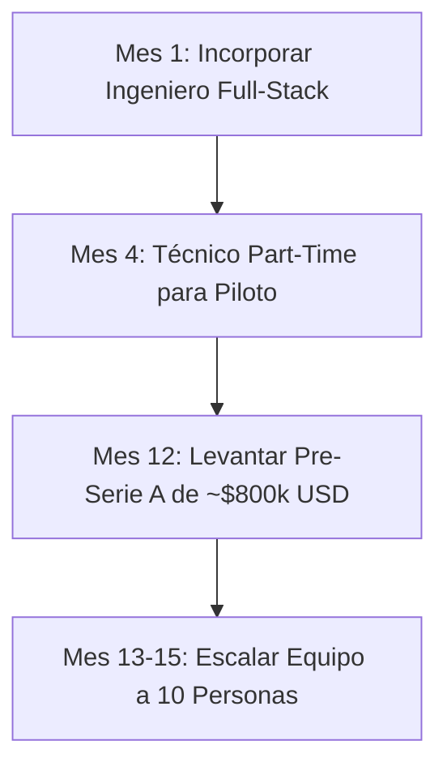

# GreenOps DC: Estrategia de Contratación, Sueldos y Escalamiento de Equipo

Este documento presenta el plan de contratación, la estructura de remuneraciones y el flujo de talento para **GreenOps DC** durante sus primeras fases de crecimiento (Ronda Semilla y Escalamiento).

---

## 1. El Equipo Inicial y Sueldos (Mes 1 al 12 - Ronda Semilla)

Durante los primeros 12 meses (Fase Piloto), el equipo estará compuesto por los **3 socios fundadores a tiempo completo** y **2 contrataciones clave** (1 de software y 1 de campo/HVAC).

### Estructura de Remuneraciones Semilla (Chile / LatAm)
*Nota: Los valores en pesos chilenos (CLP) reflejan el mercado real local, mientras que los valores en USD son la referencia para el presupuesto del inversionista.*

| Rol | Tipo de Contrato | Sueldo Líquido Mensual (CLP) | Costo Empresa Mensual (CLP) | Equivalente Mensual (USD) | Rol en el Proyecto |
| :--- | :--- | :--- | :--- | :--- | :--- |
| **CEO (Socio Fundador)** | Indefinido | $2,800,000 | $3,360,000 | $3,500 | Ventas B2B, Estrategia, Investor Relations. |
| **CTO (Socio Fundador)** | Indefinido | $3,600,000 | $4,320,000 | $4,500 | Arquitectura Cloud, Ciberseguridad IT, IA. |
| **COO / Director OT (Socio Fundador)** | Indefinido | $2,800,000 | $3,360,000 | $3,500 | Control BMS, Enlace de Planta, Ciberseguridad OT. |
| **Ingeniero Full-Stack (Key Hire)** | Indefinido | $2,000,000 | $2,400,000 | $2,500 | Apoyo al CTO en codificación frontend/backend. |
| **Técnico de Automatización (Junior)** | Honorarios / Part-Time | $1,000,000 | $1,000,000 | $1,100 | Cableado de armarios Edge y sensores en piloto. |
| **TOTAL MENSUAL PLANILLA** | | **$12,200,000** | **$14,440,000** | **$15,100** | |

---

## 2. Hoja de Ruta de Contratación (Hiring Pipeline) por Fases

Para escalar el negocio de manera eficiente (evitando el *over-hiring* antes de tener product-market fit), el reclutamiento se divide en tres hitos:



### Hito 1: Mes 1 - Desarrollador Full-Stack (SaaS)
* **Por qué:** El CTO no puede encargarse de la base de datos, las integraciones de API, la ciberseguridad corporativa y, además, diseñar las vistas web y resolver bugs cotidianos.
* **Perfil:** Desarrollador web con experiencia en JavaScript/HTML, APIs de Python (FastAPI/Django) y manejo de bases de datos relacionales.

### Hito 2: Mes 4 - Técnico Eléctrico / Automatización (OT)
* **Por qué:** Al iniciar el piloto físico, el COO requiere apoyo en terreno para montar el hardware del PC Edge, conectar los gateways Modbus a las tarjetas de red de los climatizadores y verificar el correcto funcionamiento eléctrico de los sensores de pasillo.
* **Perfil:** Técnico en automatización o instrumentista industrial con experiencia en cableado de tableros de control.

### Hito 3: Mes 13 a 24 - Escalamiento de Equipo (Post-Ronda Pre-Serie A)
Una vez validado el piloto y con los primeros 3 clientes corporativos pagando, se levanta una ronda Pre-Serie A de **$800,000 USD** para escalar. El equipo crece a 10 personas incorporando:
1. **1 Senior Data Scientist (IA / ML):** Dedicado exclusivamente a optimizar las redes neuronales de control térmico predictivo.
2. **1 Key Account Manager (Ventas B2B):** Ejecutivo senior para cerrar tratos comerciales con data centers en otros países (Colombia, Perú, Brasil).
3. **1 Ingeniero de Soporte y Customer Success:** Monitoreo remoto de alarmas y soporte técnico 24/7 a los operadores de los data centers clientes.

---

## 3. Flujo de Reclutamiento y Selección (Recruiting Pipeline)

Para garantizar la contratación de ingenieros con alta tolerancia al cambio y capacidad técnica real:

```
[1. Publicación y Filtro CVs] ──> [2. Prueba Técnica Práctica] ──> [3. Entrevista Técnica CTO/COO] ──> [4. Ajuste Cultural CEO] ──> [5. Oferta + Vesting]
```

1. **Sourcing:** Búsqueda en plataformas como **Getonbrd**, **LinkedIn** y bolsas de empleo de universidades (PUC, U. de Chile).
2. **Prueba Técnica Práctica (Home Challenge):** 
   * *Para el Dev:* Diseñar un endpoint en FastAPI que parsee un archivo XML/CSV básico y aplique una fórmula física simple.
   * *Para el Técnico:* Resolver un caso de diagnóstico de pérdida de conexión en un bus Modbus RTU/RS485.
3. **Entrevista Técnica (CTO/COO):** Evaluación de arquitectura, buenas prácticas y ciberseguridad.
4. **Cultural Fit (CEO):** Validar si el candidato tiene mentalidad de startup: alta autonomía, proactividad y enfoque en resolución de problemas complejos bajo presión.

---

## 4. Retención de Talento: Plan ESOP (Employee Stock Option Pool)

Como los sueldos en etapa temprana de una startup son ligeramente menores a los que pagan los grandes bancos o multinacionales, se implementa un **ESOP del 10% de las acciones de la empresa**:

* **¿Cómo funciona?** Se reserva un pozo del 10% del total de las acciones de GreenOps DC para ser distribuido entre los empleados clave (como el primer Ingeniero Full-Stack o el Senior Data Scientist).
* **Vesting (Maduración):** Las opciones de acciones se entregan bajo un esquema de maduración de **4 años con un "Cliff" de 1 año**:
  * Si el empleado se va antes de cumplir 1 año, recibe 0% de las acciones.
  * Al cumplir el año 1, libera el 25% de sus opciones.
  * A partir de ahí, libera un porcentaje mensual hasta cumplir los 4 años.
* **Beneficio para el Inversionista:** Le demuestra que los ingenieros clave están alineados con el crecimiento a largo plazo y que el talento no se fugará a mitad del proyecto.
